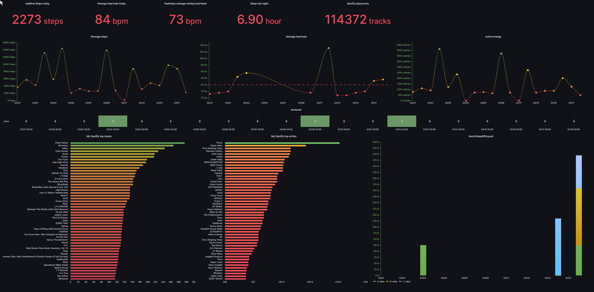

pretty self explanotary but basically i created a dashboard for myself a while back using upstream APIs of the tools on my iphone which gets its health data from my phone and apple watch and as you might know apple health does not have any API to pull data unless u write your own swift app with and utilize healthkit but thats whole different thing so i utilized https://exist.io/ and its APIs that syncs with my apple health data. I also use spotify and soundcloud so instead of using spotify's pretty bad API and its OAUTH issues, I went with lastfm because i can grab metrics from both spotify and soundcloud directly from just lastfm API so i did that and made handy dandy dashboard which made call of these calls every 5 minutes because anything lower than that got me rate limited. I used the free grafana instance on web but feel free to self host it etc. just import the json model to your instance as a dashboard. go thru the API docs i wrote while i was creating the dashboard, replace the tokens in json model and u should be able to see that data. have fun.

https://stackoverflow.com/questions/56865301/how-to-import-grafana-dashboard-json-file-manually

